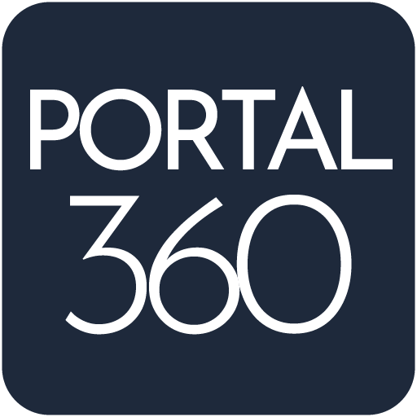

# 

- **Año:** 2026
- **Fecha:** 26 de marzo
- **Empresa:** QUAZZAR TECHNOLOGIES

---

##  Contenido

| Sección | Descripción              |
| :------ | :----------------------- |
| **1.**  | OBJETIVO DEL PRODUCTO    |
| **2.**  | PROPUESTA DE VALOR       |
| **3.**  | PERFILES DE USUARIO      |
| **4.**  | MÓDULOS PRINCIPALES      |
| **5.**  | FLUJO DE FUNCIONAMIENTO  |
| **6.**  | ALCANCE INICIAL          |
| **7.**  | FUERA DE ALCANCE INICIAL |

---

## 1. OBJETIVO DEL PRODUCTO

Optimizar la comunicación y los procesos administrativos entre la empresa y su capital humano. Portal360 busca centralizar en un único entorno digital la gestión de nóminas, trámites de asistencia y documentación personal, eliminando la burocracia manual.

## 2. PROPUESTA DE VALOR

La implementación de Portal360 genera un impacto positivo inmediato en la cultura organizacional y la eficiencia operativa a través de los siguientes pilares:

### 2.1. Eficiencia Administrativa y Ahorro de Tiempo

- **Descentralización de tareas:** Al permitir que el empleado descargue sus propias nóminas o suba sus certificados, el departamento de RRHH reduce drásticamente el tiempo dedicado a tareas manuales y repetitivas.
- **Reducción de burocracia:** Digitalizar las solicitudes de ausencia elimina el intercambio infinito de correos electrónicos y hojas de papel.

### 2.2. Cumplimiento Normativo y Legal

- **Registro de Jornada Obligatorio:** Garantiza que la empresa cumpla con la normativa laboral vigente de registro horario mediante un sistema auditable y transparente.
- **Seguridad de la Información:** Centraliza documentos sensibles, como las nóminas o el DNI del empleado, en un entorno seguro con permisos controlados, cumpliendo con las leyes de protección de datos.

### 2.3. Mejora en la Experiencia del Empleado

- **Autonomía y Transparencia:** El trabajador tiene acceso 24/7 a su información laboral desde cualquier dispositivo, lo que aumenta la confianza en la organización.
- **Comunicación Directa:** El sistema de reportes agiliza la resolución de dudas o errores, evitando la frustración del empleado por falta de respuesta.

### 2.4. Centralización y orden

- **Expediente Único Digital:** Se elimina el riesgo de pérdida de documentos físicos o archivos dispersos en diferentes carpetas de red. Toda la trayectoria del empleado reside en un solo lugar.

---

## 3. PERFILES DE USUARIO

### 3.1. Empleado

Usuario final que accede para consultar su información, fichar su jornada, subir documentos y realizar solicitudes.

### 3.2. Gestor de RRHH

Gestiona los documentos, nóminas y reportes de incidencias de todos los empleados.

### 3.3. Administrador

Perfil con permisos totales para configurar el sistema, cambiar roles y eliminar datos.

## 4. MÓDULOS PRINCIPALES

### 4.1. Módulo Principal

Un dashboard donde se puede echar un vistazo general de información que puede ser de interés para el usuario.

### 4.2. Módulo de Control Horario

Herramienta de fichaje digital para registrar entrada, salida, y pausas, cumpliendo con la normativa laboral vigente.

### 4.3. Módulo de Retribuciones

Repositorio histórico donde el empleado puede visualizar y descargar sus nóminas y certificados de retenciones.

### 4.4. Módulo de Ausencias y Vacaciones:

Calendario interactivo para solicitar días libres, bajas médicas o permisos, con flujo de aprobación en tiempo real.

### 4.5. Expediente Digital:

Espacio para que el empleado suba y actualice documentos personales (DNI, títulos, certificados, etc.).

### 4.6. Centro de Notificaciones y Reportes:

Canal de comunicación directa para el empleado reciba actualizaciones de estado para sus diferentes consultas o incidencias.

---

## 5. FLUJO DE FUNCIONAMIENTO

El sistema opera bajo un modelo de interacción bidireccional entre el empleado y el departamento de Gestión de Personas, siguiendo este ciclo operativo:

### 5.1. Leyenda de Actores (Roles)

- **Empleado [EMP]**
- **Recursos Humanos [RRHH]**
- **Administrador [ADM]**

### 5.2. Flujo de Procesos

- **Gestión de Jornada y Cumplimiento:**
  **[EMP]** Inicio de jornada (fichaje digital) -> **[ADM/RRHH]** Supervisión en tiempo real -> **[RRHH]** Reporte de horas al cierre de mes.
- **Ciclo de Solicitud de Ausencias:** **[EMP]** Realiza petición en calendario -> **[RRHH]** Notificación de revisión -> **[RRHH]** Validación de documentos/días ->  **[EMP]** Recepción de confirmación -> **[RRHH]** Auditoría de histórico de ausencias.
- **Gestión de Expediente y Documentación:** **[ADM]** Configura campos ->  **[EMP]** Carga documentos (DNI/certificados) -> **[RRHH]** Verifica y archiva -> **[EMP]** Acceso permanente a consulta.
- **Incidencias:** **[EMP]** Abre ticket -> **[RRHH]** Analiza y responde -> **[ADM]** Intervención en Base de Datos -> **[EMP]** Cierre de incidencia.

---

## 6. ALCANCE INICIAL

### 6.1. Registro y login seguro de usuarios.

### 6.2. Visualización y descarga de PDFs de nóminas.

### 6.3. Sistema básico de fichaje (Botón inicio/pausa/fin y modalidad presencial/teletrabajo).

### 6.4. Formulario de solicitud de ausencias.

### 6.5. Carga de documentos básicos en el perfil.

### 6.6. Sistema de reportes de incidencias a RRHH.

## 7. FUERA DE ALCANCE INICIAL

### 7.1. Tablón de Anuncios Corporativos

Si bien se integrará en el dashboard principal en el futuro para centralizar la comunicación interna, no formará parte de la navegación inicial.

### 7.2. Módulo de Gestión de EPIs

El control, registro y entrega de Equipos de Protección Individual se gestionará de forma externa hasta la segunda fase de desarrollo.

### 7.3. Fichaje mediante Código QR

En esta etapa inicial, el registro de jornada se realizará exclusivamente mediante el botón digita en el portal. La implementación o escaneo de QR en puntos de acceso queda pospuesta.
